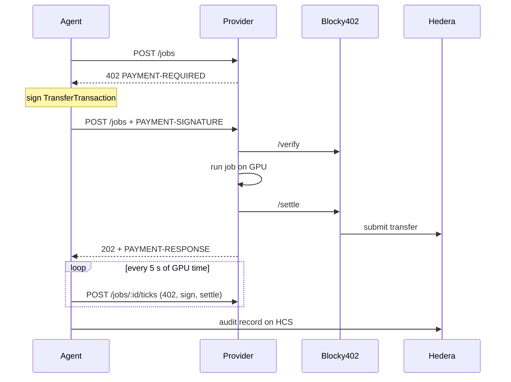

# DeComp

A GPU compute market for AI agents. Agents rent Apple-silicon GPUs and pay **per five seconds
of measured GPU time** with [x402](https://x402.org), settled on **Hedera** through the
[Blocky402](https://blocky402.com) facilitator. Providers advertise themselves on the Hedera
Consensus Service (HCS), agents route to the cheapest one, and every job leaves an audit record on
HCS that anyone can check against the chain.

- **x402-gated service.** Creating a job answers with HTTP 402; the agent signs a Hedera
  transfer, the provider verifies and settles it through Blocky402, then runs the job on the GPU.
- **Metered, streamed payments.** Jobs are paid in 5-second ticks. Each new tick is a fresh 402
  "continue" challenge, and the provider kills any job that stops being paid for.
- **Discovery on HCS.** Providers register their prices on an HCS topic; agents pick the cheapest
  eligible provider and fall back if it's down, never after a payment is signed.
- **HBAR or a compute token.** Pay in HBAR or DeComp Compute Credit (DCC), an HTS token.
- **Independent audit trail.** A standalone script rebuilds each provider's earnings from HCS and
  the mirror node alone.

See [docs/ARCHITECTURE.md](docs/ARCHITECTURE.md) for the full design and trust model.

## Live on Hedera testnet

| What | Link |
|---|---|
| Blocky402 fee payer | [0.0.7162784](https://hashscan.io/testnet/account/0.0.7162784) |
| Agent account | [0.0.10481877](https://hashscan.io/testnet/account/0.0.10481877) |
| Provider accounts | [0.0.10481879](https://hashscan.io/testnet/account/0.0.10481879), [0.0.10481883](https://hashscan.io/testnet/account/0.0.10481883), [0.0.10481887](https://hashscan.io/testnet/account/0.0.10481887) |
| Provider registry topic | [0.0.10482100](https://hashscan.io/testnet/topic/0.0.10482100) |
| Job audit topic | [0.0.10482650](https://hashscan.io/testnet/topic/0.0.10482650) |
| Compute token (DCC) | [0.0.10482651](https://hashscan.io/testnet/token/0.0.10482651) |
| A paid GPU job | [0.0.7162784@1789151420.640010073](https://hashscan.io/testnet/transaction/0.0.7162784@1789151420.640010073) |
| One job, four streamed ticks | [tick 1](https://hashscan.io/testnet/transaction/0.0.7162784@1789152917.726789395), [2](https://hashscan.io/testnet/transaction/0.0.7162784@1789152923.314812425), [3](https://hashscan.io/testnet/transaction/0.0.7162784@1789152927.337487032), [4](https://hashscan.io/testnet/transaction/0.0.7162784@1789152934.051286630) |
| A job paid entirely in DCC | [tick 1](https://hashscan.io/testnet/transaction/0.0.7162784@1789154031.435050243), [2](https://hashscan.io/testnet/transaction/0.0.7162784@1789154034.468670607), [3](https://hashscan.io/testnet/transaction/0.0.7162784@1789154039.545078109) |

Each build phase is tagged where its validation gate passed on testnet:
[`v0.1.0-qualified`](../../releases/tag/v0.1.0-qualified) (paid job end to end),
[`v0.2.0`](../../releases/tag/v0.2.0) (discovery and routing),
[`v0.3.0`](../../releases/tag/v0.3.0) (metered ticks),
[`v0.4.0`](../../releases/tag/v0.4.0) (audit trail and token payments).

## How a payment works

1. The agent reads the provider registry on HCS and picks the cheapest provider offering the job.
2. `POST /jobs` returns **402** with a `PAYMENT-REQUIRED` header (also mirrored in the JSON body):
   the x402 `exact` scheme on `hedera:testnet`, one tick's price in HBAR (and DCC when enabled),
   the provider's `payTo` account, and `extra.feePayer`, the facilitator's account.
3. The agent builds a Hedera `TransferTransaction` from itself to the provider, with the
   transaction id under the facilitator's fee payer, signs it, and retries with the
   `PAYMENT-SIGNATURE` header. It never submits the transaction or pays fees itself.
4. The provider calls Blocky402 `/verify`, checks the payer's signature against its on-chain key
   itself, starts the job on the GPU, then calls `/settle`. Blocky402 adds the fee payer's
   signature and submits the transfer to Hedera.
5. The provider answers **202** with the job id and a `PAYMENT-RESPONSE` header carrying the
   settlement transaction id.
6. While the job runs, the agent buys each next 5-second tick through `POST /jobs/:id/ticks`,
   which repeats steps 2–5 in the job's asset. The provider kills the job if its measured runtime
   passes paid time plus a 5-second grace period.
7. When the job ends, the agent fetches the result, confirms every settlement on the mirror
   node, and publishes an audit record to HCS.



## Requirements

- An Apple-silicon Mac. The job runner refuses to run on CPU.
- [Bun](https://bun.com) 1.2 or newer.
- [uv](https://docs.astral.sh/uv/), which installs Python 3.12 for the job runner.
- One **ECDSA** Hedera testnet account from [portal.hedera.com](https://portal.hedera.com); new
  portal accounts come with 1,000 testnet ℏ.

## Setup

```bash
bun install
bun run setup:runner          # Python 3.12 venv with MLX, PyTorch, FastAPI
cp .env.example .env          # then set OPERATOR_ID and OPERATOR_KEY
bun run setup:hedera          # creates and funds the agent and three provider accounts
bun run setup:topics          # creates the HCS registry and audit topics
bun run setup:token           # mints DCC, associates accounts, funds the agent
bun run check:phase0          # facilitator, balances, GPU backends, lockfile
```

- **`OPERATOR_ID` / `OPERATOR_KEY`** are the only values you fill in by hand. The key can be the
  portal's HEX (with or without `0x`) or DER form.
- **`setup:hedera`** generates keys for the agent and three providers, funds them (50 ℏ and
  5 ℏ each), and writes their credentials to `.env` as it goes.
- **`setup:topics` and `setup:token`** write their topic and token ids to `.env`.
- **All setup scripts are safe to re-run.** They reuse whatever `.env` already has.

`.env` holds private keys. It is gitignored; never commit it.

## Run it

Start the job runner and three providers, each registering on HCS as it boots:

```bash
bun run dev
```

In a second terminal:

```bash
# A GPU render, routed to the cheapest provider, paid tick by tick; saves the image
bun run agent -- --job mandelbrot --params '{"width":2048,"height":2048,"max_iter":2000}' --save out/mandelbrot.png

# See the raw 402 challenge
curl -si -X POST localhost:4023/jobs -H 'content-type: application/json' -d '{"jobType":"mandelbrot"}'

# Stop paying after 0.3 ℏ; the provider stops the job once paid time runs out
bun run agent -- --job mandelbrot --params '{"width":2048,"height":2048,"max_iter":4000}' --budget-hbar 0.3

# Pay in the compute token (use COMPUTE_TOKEN_ID from .env)
bun run agent -- --provider http://127.0.0.1:4021 --job benchmark --asset 0.0.10482651 --max-amount 50

# Rebuild every provider's earnings from the audit topic and the mirror node alone
bun run audit:reconstruct
```

To see fallback, restart the network without one provider with `bun run dev -- --skip PROVIDER_2`;
its registration stays on HCS, so `bun run agent -- --job benchmark` tries it, finds it down, and
pays PROVIDER_1 instead.

### Agent options

| Option | Default | Meaning |
|---|---|---|
| `--job` | `benchmark` | Job type: `benchmark` or `mandelbrot` |
| `--params` | `{}` | Job parameters as JSON (see [Jobs](#jobs)) |
| `--provider` | registry routing | Use one provider URL instead of routing via HCS |
| `--asset` | `0.0.0` (HBAR) | HTS token id to pay in; needs `--provider` and `--max-amount` |
| `--budget-hbar` / `--budget` | none | Total spend cap, in HBAR or the asset's smallest unit |
| `--max-hbar` / `--max-amount` | `1` ℏ | Per-payment cap with `--provider` (routed jobs cap at the registered price) |
| `--save` | none | Write an image result to this path |
| `--audit-topic` | `AUDIT_TOPIC_ID` | HCS topic for the job's audit record |
| `--skip-mirror` | off | Don't wait to confirm settlements on the mirror node |
| `--json` | off | Print the job summary as JSON |

### Provider settings

`bun run dev` sets these per provider; set them yourself to run `bun run dev:provider` directly.

| Variable | Default | Meaning |
|---|---|---|
| `PROVIDER_NAME` | `PROVIDER_1` | Which `<NAME>_ACCOUNT_ID` / `<NAME>_PRIVATE_KEY` to use |
| `PORT` | `4021` | HTTP port |
| `PROVIDER_OFFERS` | `benchmark:2000000` | Job types and tinybars per GPU-second |
| `PROVIDER_TOKEN_OFFERS` | none | Prices in `COMPUTE_TOKEN_ID` units per second; must cover every job type |
| `TICK_SECONDS` | `5` | Length of a paid tick |
| `TICK_GRACE_SECONDS` | `5` | How long past its paid time a job may run before it's killed |
| `MAX_RUNTIME_S` | `600` | Hard runtime limit per job |
| `PUBLIC_URL` | `http://127.0.0.1:<PORT>` | Endpoint advertised in the registry |
| `REGISTRY_TOPIC_ID` | from `.env` | Registry topic; empty disables registration |
| `JOB_RUNNER_URL` | `http://127.0.0.1:8100` | Job runner address |

## Jobs

Jobs run on the GPU from a fixed menu; parameters are validated by the job runner.

| Job | Parameters | Output |
|---|---|---|
| `benchmark` | `backend` (`mlx`, `torch`), `size` (512–4096), `duration_s` (0.5–600) | Iterations, GFLOPS, device, checksum |
| `mandelbrot` | `width`, `height` (64–4096), `max_iter` (16–20000), `center_x`, `center_y`, `span` | PNG image and its SHA-256 |

On an M4, a 2048×2048 matmul runs at about 2,600 GFLOPS, and a 2048×2048 Mandelbrot at 3,000
iterations takes about 18 s.

## Validation gates

Each phase of [docs/BUILD_PLAN.md](docs/BUILD_PLAN.md) has a script that checks its gate against
live testnet. They start the services they need, and they spend a little testnet HBAR.

| Command | Checks |
|---|---|
| `bun run check:phase0` | Facilitator advertises `hedera:testnet`, every account is funded, MLX and MPS see the GPU, the lockfile installs |
| `bun run validate:phase1` | The 402 carries the facilitator's fee payer, a signed payment passes `/verify`, and three paid GPU jobs settle as distinct transactions |
| `bun run validate:phase2` | Three providers register on boot, discovery filters by job type, routing picks the cheapest, fallback works when it's down |
| `bun run validate:phase3` | A >10 s GPU job, one job settling ≥3 ticks, billing within ±1 tick of measured time, provider-side kill at the budget ceiling |
| `bun run validate:phase4` | Token association, a job paid entirely in DCC, a complete audit record per job, and the standalone reconstruction matching the agent |
| `bun test` | Unit tests plus a live payment-gate suite that needs no funded accounts |

Stop `bun run dev` before running a gate; the gates start their own services.

## Project layout

| Path | What it is |
|---|---|
| `apps/agent` | Agent CLI and library: discovery, routing, tick payments, audit records |
| `apps/provider` | Provider server: x402 gate, pricing, metered job queue, HCS registration |
| `packages/hedera-x402` | x402 on Hedera: Bun payment gate, paying client, facilitator wiring, mirror and token helpers |
| `packages/hcs-registry` | HCS schemas for registrations and audit records, publishing, chunk-aware readers |
| `services/job-runner` | FastAPI job runner with the GPU job menu and wall-clock metering |
| `scripts/` | Setup, `dev`, validation gates, and `reconstruct-audit.ts` |
| `docs/` | [Architecture](docs/ARCHITECTURE.md), [build plan](docs/BUILD_PLAN.md), [demo script](docs/DEMO_SCRIPT.md) |

## Security notes

- **Keys stay local.** Private keys live only in `.env`, which is gitignored; every commit in
  this repository was scanned for key material.
- **The provider checks payer signatures itself.** Blocky402's hosted testnet `/verify` returned
  `isValid: true` for transfers signed with the wrong key (observed 2026-09-12); such payments
  only fail at settlement. The provider verifies every payer's signature against its on-chain
  key before starting paid work.
- **Limits.** Providers aren't cryptographically proven to have run a job, and up to one grace
  period of compute can go unpaid; see
  [Trust model and limits](docs/ARCHITECTURE.md#trust-model-and-limits).

## Troubleshooting

| Symptom | Fix |
|---|---|
| `MLX default device is cpu` | Run on an Apple-silicon Mac; re-run `bun run setup:runner`. |
| `TOKEN_NOT_ASSOCIATED_TO_ACCOUNT` or a `preflight_failed` 402 | Run `bun run setup:token`, and check the agent's balance. |
| `stop running providers first` | Stop `bun run dev` before running a validation gate. |
| `job runner not reachable` | `bun run dev` starts it; for a single provider, run `bun run dev:runner` too. |
| HTTP 429 from the facilitator | Blocky402 testnet allows 100 requests a minute per IP; wait a minute. |
| A new transaction isn't on HashScan yet | The mirror node trails consensus by a few seconds. |
