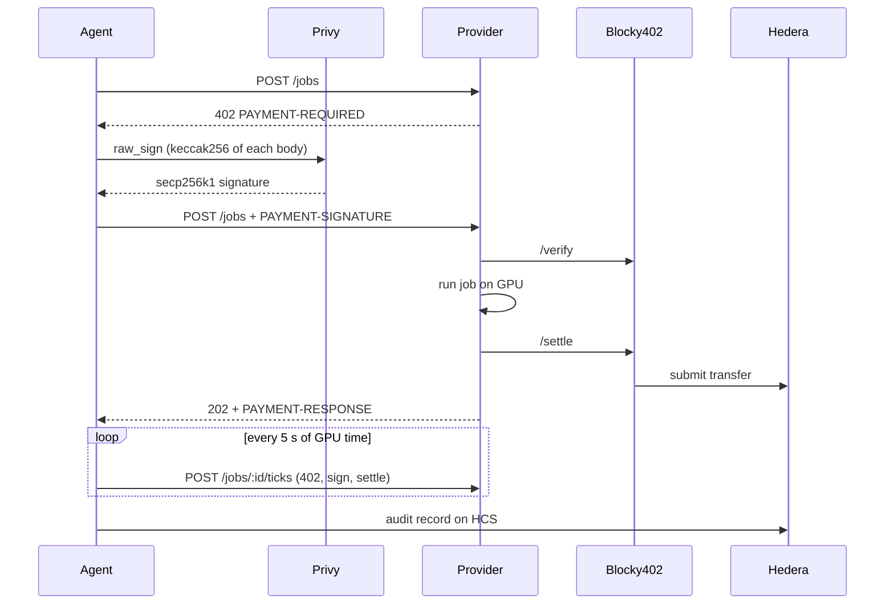

# DeComp

A GPU compute market for AI agents. Agents rent Apple-silicon GPUs and pay **per five seconds
of measured GPU time** with [x402](https://x402.org), settled on **Hedera** through the
[Blocky402](https://blocky402.com) facilitator. Providers advertise themselves on the Hedera
Consensus Service (HCS), agents route to the cheapest one, and every job leaves an audit record on
HCS that anyone can check against the chain.

**No private keys.** Every account — agent, providers, operator — is keyed by a
[Privy](https://privy.io) wallet. Signing happens inside Privy; this project only ever sees
signatures, and `.env` holds no Hedera key material at all.

- **x402-gated service.** Creating a job answers with HTTP 402; the agent's Privy wallet signs a
  Hedera transfer, the provider verifies and settles it through Blocky402, then runs the job.
- **Metered, streamed payments.** Jobs are paid in 5-second ticks. Each new tick is a fresh 402
  "continue" challenge, and the provider kills any job that stops being paid for.
- **Discovery on HCS.** Providers register their prices on an HCS topic; agents pick the cheapest
  eligible provider and fall back if it's down, never after a payment is signed.
- **HBAR or a compute token.** Pay in HBAR or DeComp Compute Credit (DCC), an HTS token.
- **Independent audit trail.** A standalone script rebuilds each provider's earnings from HCS and
  the mirror node alone.
- **A Claude connector.** Sign in once with Privy and run paid GPU jobs by chatting — no terminal,
  no `.env`, no key, on your own DeComp wallet. See [Claude connector](#claude-connector).

See [docs/ARCHITECTURE.md](docs/ARCHITECTURE.md) for the full design and trust model.

## Wallets and identity

Each role (`OPERATOR`, `AGENT`, `PROVIDER_1…3`) is a Privy wallet plus the Hedera account it
keys. Privy has no Hedera chain type, so these are secp256k1 (`ethereum`) wallets used purely as
signers: Hedera ECDSA signatures are secp256k1 over the keccak256 digest of each transaction body,
which Privy's `raw_sign` produces directly.

Everything downstream takes a `HederaIdentity` — an account plus a signer — rather than a key.
The fixed roles resolve it from `<ROLE>_WALLET_ID` in `.env`; the [Claude connector](#claude-connector)
resolves the same object from an OAuth-authenticated Privy user instead, without changing the
agent, provider, or gates at all.

## Live on Hedera testnet

Every account below is keyed by a Privy wallet, and every transaction linked here was signed
inside Privy.

| What | Link |
|---|---|
| Blocky402 fee payer | [0.0.7162784](https://hashscan.io/testnet/account/0.0.7162784) |
| Agent | [0.0.10490089](https://hashscan.io/testnet/account/0.0.10490089) |
| Providers | [0.0.10490091](https://hashscan.io/testnet/account/0.0.10490091), [0.0.10490092](https://hashscan.io/testnet/account/0.0.10490092), [0.0.10490095](https://hashscan.io/testnet/account/0.0.10490095) |
| Operator (treasury) | [0.0.10490087](https://hashscan.io/testnet/account/0.0.10490087) |
| Provider registry topic | [0.0.10490097](https://hashscan.io/testnet/topic/0.0.10490097) |
| Job audit topic | [0.0.10482650](https://hashscan.io/testnet/topic/0.0.10482650) |
| Compute token (DCC) | [0.0.10490098](https://hashscan.io/testnet/token/0.0.10490098) |
| A paid GPU job | [0.0.7162784@1789178567.035930527](https://hashscan.io/testnet/transaction/0.0.7162784@1789178567.035930527) |
| Routed to the cheapest provider, then a fallback payment | [0.0.7162784@1789178826.107845366](https://hashscan.io/testnet/transaction/0.0.7162784@1789178826.107845366) |
| One job in three streamed HBAR ticks (audit seq 8) | [tick 1](https://hashscan.io/testnet/transaction/0.0.7162784@1789178972.245387934), [2](https://hashscan.io/testnet/transaction/0.0.7162784@1789178978.208479584), [3](https://hashscan.io/testnet/transaction/0.0.7162784@1789178983.334990514) |
| A job paid entirely in DCC (audit seq 7) | [tick 1](https://hashscan.io/testnet/transaction/0.0.7162784@1789178949.501231845), [2](https://hashscan.io/testnet/transaction/0.0.7162784@1789178956.447225748), [3](https://hashscan.io/testnet/transaction/0.0.7162784@1789178958.159679750) |

Each build phase is tagged where its validation gate passed on testnet:
[`v0.1.0-qualified`](../../releases/tag/v0.1.0-qualified) (paid job end to end),
[`v0.2.0`](../../releases/tag/v0.2.0) (discovery and routing),
[`v0.3.0`](../../releases/tag/v0.3.0) (metered ticks),
[`v0.4.0`](../../releases/tag/v0.4.0) (audit trail and token payments),
[`v0.5.0`](../../releases/tag/v0.5.0) (submission docs and fresh-clone reproduction),
[`v0.6.0`](../../releases/tag/v0.6.0) (Privy wallets, no private keys).

All four gates were re-run on 2026-09-12 against these Privy-keyed accounts: three paid jobs
end to end, discovery and fallback, a job settling five ticks with billing matching measured
time exactly, and a job paid entirely in DCC with its audit record reconstructed from the chain.
The settlements from the earlier key-based accounts remain valid and are cited in the tags above.

## How a payment works

1. The agent reads the provider registry on HCS and picks the cheapest provider offering the job.
2. `POST /jobs` returns **402** with a `PAYMENT-REQUIRED` header (also mirrored in the JSON body):
   the x402 `exact` scheme on `hedera:testnet`, one tick's price in HBAR (and DCC when enabled),
   the provider's `payTo` account, and `extra.feePayer`, the facilitator's account.
3. The agent builds a Hedera `TransferTransaction` from itself to the provider, with the
   transaction id under the facilitator's fee payer, and asks **Privy** to sign each transaction
   body. It never submits the transaction or pays fees itself.
4. The provider calls Blocky402 `/verify`, checks the payer's signature against its on-chain key
   itself, starts the job on the GPU, then calls `/settle`. Blocky402 adds the fee payer's
   signature and submits the transfer to Hedera.
5. The provider answers **202** with the job id and a `PAYMENT-RESPONSE` header carrying the
   settlement transaction id.
6. While the job runs, the agent buys each next 5-second tick through `POST /jobs/:id/ticks`,
   which repeats steps 2–5 in the job's asset. The provider kills the job if its measured runtime
   passes paid time plus a 5-second grace period.
7. When the job ends, the agent fetches the result, confirms every settlement on the mirror
   node, and publishes an audit record to HCS, again signed by its Privy wallet.



## Requirements

- An Apple-silicon Mac. The job runner refuses to run on CPU.
- [Bun](https://bun.com) 1.2 or newer.
- [uv](https://docs.astral.sh/uv/), which installs Python 3.12 for the job runner.
- A [Privy](https://dashboard.privy.io) app, for its app id and app secret.
- One funded Hedera testnet account, used **once** to create and fund the operator's account.
  [portal.hedera.com](https://portal.hedera.com) gives new accounts 1,000 testnet ℏ.

## Setup

```bash
bun install
bun run setup:runner          # Python 3.12 venv with MLX, PyTorch, FastAPI
cp .env.example .env          # then set PRIVY_APP_ID and PRIVY_APP_SECRET

# first run only: fund the operator from an existing account. The key is used once, passed on the
# command line, and never stored.
bun run setup:privy -- --bootstrap-account 0.0.1234 --bootstrap-key <hex or DER key>

bun run setup:topics          # creates the HCS registry and audit topics
bun run setup:token           # mints DCC, associates accounts, funds the agent
bun run check:phase0          # facilitator, wallets, balances, GPU backends, lockfile
```

- **`PRIVY_APP_ID` / `PRIVY_APP_SECRET`** are the only secrets in `.env`. Get them from the Privy
  dashboard under App settings → API keys.
- **`setup:privy`** creates a Privy wallet per role, creates the Hedera account each one keys,
  funds it, and writes the wallet and account ids to `.env`. Re-running it reuses both.
- **Everything after bootstrap is signed by Privy**, including topic creation, the token mint,
  associations, registrations, payments, and audit records.
- **`check:phase0`** fails if an account is not keyed to its wallet, which is the failure that
  would otherwise surface as an opaque `INVALID_SIGNATURE` later.

`.env` holds no Hedera private keys. It does hold your Privy app secret, so keep it out of git;
it is gitignored.

## Run it

Start the job runner and three providers, each registering on HCS as it boots:

```bash
bun run dev
```

In a second terminal:

```bash
# A GPU render, routed to the cheapest provider, paid tick by tick; saves the image
bun run agent -- --job mandelbrot --params '{"width":2048,"height":2048,"max_iter":2000}' --save out/mandelbrot.png

# See the raw 402 challenge
curl -si -X POST localhost:4023/jobs -H 'content-type: application/json' -d '{"jobType":"mandelbrot"}'

# Stop paying after 0.3 ℏ; the provider stops the job once paid time runs out
bun run agent -- --job mandelbrot --params '{"width":2048,"height":2048,"max_iter":4000}' --budget-hbar 0.3

# Pay in the compute token (use COMPUTE_TOKEN_ID from .env)
bun run agent -- --provider http://127.0.0.1:4021 --job benchmark --asset 0.0.10482651 --max-amount 50

# Rebuild every provider's earnings from the audit topic and the mirror node alone
bun run audit:reconstruct
```

To see fallback, restart the network without one provider with `bun run dev -- --skip PROVIDER_2`;
its registration stays on HCS, so `bun run agent -- --job benchmark` tries it, finds it down, and
pays PROVIDER_1 instead.

### Agent options

| Option | Default | Meaning |
|---|---|---|
| `--job` | `benchmark` | Job type: `benchmark` or `mandelbrot` |
| `--params` | `{}` | Job parameters as JSON (see [Jobs](#jobs)) |
| `--provider` | registry routing | Use one provider URL instead of routing via HCS |
| `--asset` | `0.0.0` (HBAR) | HTS token id to pay in; needs `--provider` and `--max-amount` |
| `--budget-hbar` / `--budget` | none | Total spend cap, in HBAR or the asset's smallest unit |
| `--max-hbar` / `--max-amount` | `1` ℏ | Per-payment cap with `--provider` (routed jobs cap at the registered price) |
| `--save` | none | Write an image result to this path |
| `--audit-topic` | `AUDIT_TOPIC_ID` | HCS topic for the job's audit record |
| `--skip-mirror` | off | Don't wait to confirm settlements on the mirror node |
| `--json` | off | Print the job summary as JSON |

### Provider settings

`bun run dev` sets these per provider; set them yourself to run `bun run dev:provider` directly.

| Variable | Default | Meaning |
|---|---|---|
| `PROVIDER_NAME` | `PROVIDER_1` | Which `<NAME>_WALLET_ID` / `<NAME>_ACCOUNT_ID` to use |
| `PORT` | `4021` | HTTP port |
| `PROVIDER_OFFERS` | `benchmark:2000000` | Job types and tinybars per GPU-second |
| `PROVIDER_TOKEN_OFFERS` | none | Prices in `COMPUTE_TOKEN_ID` units per second; must cover every job type |
| `TICK_SECONDS` | `5` | Length of a paid tick |
| `TICK_GRACE_SECONDS` | `5` | How long past its paid time a job may run before it's killed |
| `MAX_RUNTIME_S` | `600` | Hard runtime limit per job |
| `PUBLIC_URL` | `http://127.0.0.1:<PORT>` | Endpoint advertised in the registry |
| `REGISTRY_TOPIC_ID` | from `.env` | Registry topic; empty disables registration |
| `JOB_RUNNER_URL` | `http://127.0.0.1:8100` | Job runner address |

A provider only needs its Privy wallet to register on HCS; taking payment needs nothing but its
account id, since the agent signs and the facilitator submits.

## Claude connector

`apps/connector` is a remote MCP server with its own minimal OAuth 2.1 authorization server in
front of it, so a person can add DeComp as a **custom connector** in Claude, sign in once with
Privy, and run paid GPU jobs by chatting — no terminal, no `.env`, no key on their side. Privy
authenticates the person; the connector then resolves the same `HederaIdentity` shape everything
else in this project already uses, for a wallet it provisions on their first login. See
[Architecture: Claude connector](docs/ARCHITECTURE.md#claude-connector) for the full design,
including the custody tradeoff — it's still an app-owned wallet, same as every other role here.

Setup, beyond the base `.env` above:

```bash
# Generate a secret for the connector's own OAuth tokens
echo "CONNECTOR_TOKEN_SECRET=$(openssl rand -hex 32)" >> .env

# At dashboard.privy.io → your app → App settings, turn on at least one login method (email is
# enough). Privy access tokens are verified against the app's JWKS endpoint automatically, from
# PRIVY_APP_ID alone — nothing else to copy in.

bun run connector          # http://127.0.0.1:4030
```

claude.ai can't reach `127.0.0.1`, so put a tunnel (e.g. `ngrok http 4030`) in front of it and set
`CONNECTOR_BASE_URL` to the tunnel's URL before adding it as a connector for real. In Claude:
Settings → Connectors → Add custom connector → paste the tunnel URL. Claude registers itself
automatically, opens the login page, and from then on tool calls like "render a mandelbrot at
2048x2048" or "what's my balance" run as that person's own wallet.

Tools: `run_gpu_job` (pays for and runs a job, capped by `CONNECTOR_MAX_BUDGET_HBAR`; a mandelbrot
result comes back as an inline image), `list_providers`, `get_wallet_balance`, `get_job_history`.

## Jobs

Jobs run on the GPU from a fixed menu; parameters are validated by the job runner.

| Job | Parameters | Output |
|---|---|---|
| `benchmark` | `backend` (`mlx`, `torch`), `size` (512–4096), `duration_s` (0.5–600) | Iterations, GFLOPS, device, checksum |
| `mandelbrot` | `width`, `height` (64–4096), `max_iter` (16–20000), `center_x`, `center_y`, `span` | PNG image and its SHA-256 |

On an M4, a 2048×2048 matmul runs at about 2,600 GFLOPS, and a 2048×2048 Mandelbrot at 3,000
iterations takes about 18 s.

## Validation gates

Each phase of [docs/BUILD_PLAN.md](docs/BUILD_PLAN.md) has a script that checks its gate against
live testnet. They start the services they need, and they spend a little testnet HBAR.

| Command | Checks |
|---|---|
| `bun run check:phase0` | Facilitator advertises `hedera:testnet`, every account is keyed to its Privy wallet and funded, MLX and MPS see the GPU, the lockfile installs |
| `bun run validate:phase1` | The 402 carries the facilitator's fee payer, a Privy-signed payment passes `/verify`, and three paid GPU jobs settle as distinct transactions |
| `bun run validate:phase2` | Three providers register on boot, discovery filters by job type, routing picks the cheapest, fallback works when it's down |
| `bun run validate:phase3` | A >10 s GPU job, one job settling ≥3 ticks, billing within ±1 tick of measured time, provider-side kill at the budget ceiling |
| `bun run validate:phase4` | Token association, a job paid entirely in DCC, a complete audit record per job, and the standalone reconstruction matching the agent |
| `bun test` | Unit tests, including the Privy signer against a stubbed API, plus a live payment-gate suite that needs no funded accounts |

Stop `bun run dev` before running a gate; the gates start their own services.

## Project layout

| Path | What it is |
|---|---|
| `apps/agent` | Agent CLI and library: discovery, routing, tick payments, audit records |
| `apps/provider` | Provider server: x402 gate, pricing, metered job queue, HCS registration |
| `apps/connector` | Claude connector: OAuth 2.1 AS/RS + MCP server, Privy login, per-user wallets |
| `packages/privy-hedera` | Privy wallets as Hedera signers: REST client, key handling, identities |
| `packages/hedera-x402` | x402 on Hedera: Bun payment gate, paying client, facilitator wiring, mirror and token helpers |
| `packages/hcs-registry` | HCS schemas for registrations and audit records, publishing, chunk-aware readers |
| `services/job-runner` | FastAPI job runner with the GPU job menu and wall-clock metering |
| `scripts/` | Setup, `dev`, validation gates, and `reconstruct-audit.ts` |
| `docs/` | [Architecture](docs/ARCHITECTURE.md), [build plan](docs/BUILD_PLAN.md), [demo script](docs/DEMO_SCRIPT.md) |

## Security notes

- **No Hedera private keys.** Keys live in Privy and sign inside its TEE. The repository, `.env`,
  and process memory only ever hold signatures; every commit was scanned for key material.
- **Signatures are checked locally before use.** A wallet that signs with the wrong key fails
  immediately rather than as an opaque on-chain `INVALID_SIGNATURE`.
- **The provider checks payer signatures itself.** Blocky402's hosted testnet `/verify` returned
  `isValid: true` for transfers signed with the wrong key (observed 2026-09-12); such payments
  only fail at settlement. The provider verifies every payer's signature against its on-chain
  key before starting paid work.
- **What the Privy app secret can do.** It authorizes signing with every wallet in the app, so it
  is the one secret worth protecting here. Privy authorization keys and policies can narrow that;
  see [Trust model and limits](docs/ARCHITECTURE.md#trust-model-and-limits).

## Troubleshooting

| Symptom | Fix |
|---|---|
| `Missing PRIVY_APP_ID / PRIVY_APP_SECRET` | Create an app at dashboard.privy.io and set both in `.env`. |
| `Privy API 401` | The app credentials were rejected; check for a stale secret. |
| `is not keyed to Privy wallet` | The account and wallet don't match; clear that `<ROLE>_ACCOUNT_ID` and re-run `bun run setup:privy`. |
| `MLX default device is cpu` | Run on an Apple-silicon Mac; re-run `bun run setup:runner`. |
| `TOKEN_NOT_ASSOCIATED_TO_ACCOUNT` or a `preflight_failed` 402 | Run `bun run setup:token`, and check the agent's balance. |
| `stop running providers first` | Stop `bun run dev` before running a validation gate. |
| HTTP 429 from the facilitator | Blocky402 testnet allows 100 requests a minute per IP; wait a minute. |
| A new transaction isn't on HashScan yet | The mirror node trails consensus by a few seconds. |
| `Missing required env var CONNECTOR_TOKEN_SECRET` | Generate one: `openssl rand -hex 32`, appended to `.env`. |
| Claude connector login page shows an error | The Privy app has no login method enabled; turn one on (email is enough) in the Privy dashboard. |
