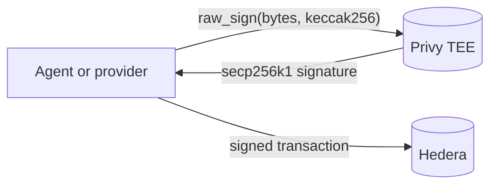
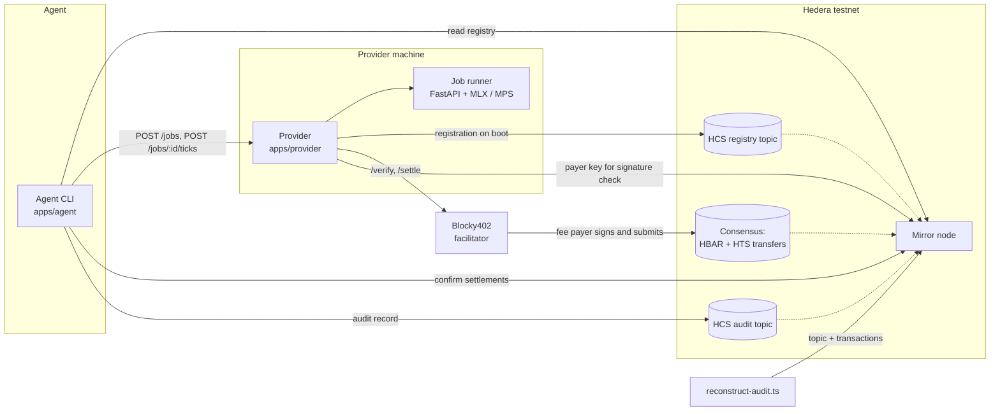
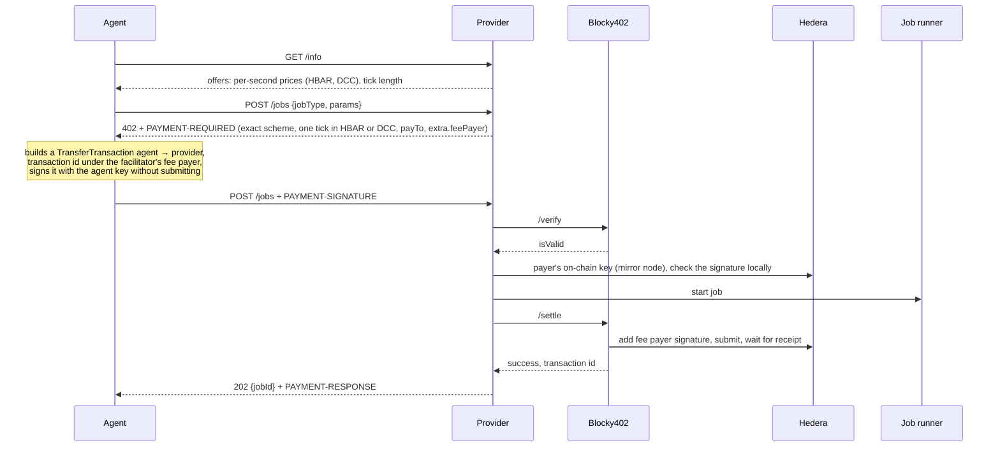
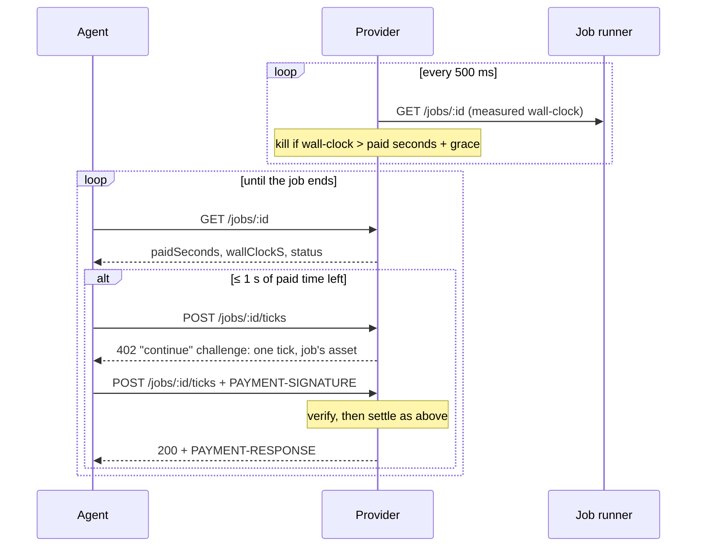

# Architecture

DeComp is a GPU compute market where AI agents pay providers per second of GPU time over
[x402](https://x402.org), settled on Hedera through the [Blocky402](https://blocky402.com)
facilitator. This document describes what is built in this repository, including where it
differs from the original [build plan](BUILD_PLAN.md).

## Components

| Component | Path | Role |
|---|---|---|
| Job runner | `services/job-runner` | FastAPI sidecar. Runs a fixed menu of jobs (`benchmark`, `mandelbrot`) as killable subprocesses on the Apple GPU (MLX or PyTorch MPS) and meters their wall-clock time. Refuses to run on CPU. |
| Provider | `apps/provider` | Bun HTTP server that sells jobs. Gates job creation and tick purchases with x402, enforces paid time, and registers itself on HCS. |
| Agent | `apps/agent` | CLI and library. Discovers providers, pays for jobs tick by tick, confirms settlements on the mirror node, and publishes an audit record. |
| `@decomp/privy-hedera` | `packages/privy-hedera` | Privy wallets as Hedera signers: a small REST client, public-key handling, and the `HederaIdentity` every app signs with. |
| `@decomp/hedera-x402` | `packages/hedera-x402` | x402 on Hedera, built on the official `@x402/core` and `@x402/hedera` packages: a Bun.serve payment gate, a step-by-step paying client, facilitator wiring with a local payer-signature check, and mirror-node and token helpers. |
| `@decomp/hcs-registry` | `packages/hcs-registry` | HCS message schemas (provider registrations, job audits), publishing, and mirror-node readers that reassemble chunked messages. |
| Scripts | `scripts/` | Wallet, topic, and token setup; `bun run dev`; the phase validation gates; the standalone audit reconstruction. |

## Wallets and identity

No Hedera private key exists anywhere in this system. Each role — `OPERATOR`, `AGENT`, and each
provider — is a [Privy](https://privy.io) wallet plus the Hedera account it keys.

Privy has no Hedera chain type, so the wallets are secp256k1 (`ethereum`) wallets used purely as
signers. That works because a Hedera ECDSA signature is plain secp256k1 over the **keccak256**
digest of a transaction body, which Privy's `raw_sign` produces directly. Two details matter:

- **Low-s normalization.** Hedera rejects high-`s` signatures, so every signature is normalized to
  its low-`s` form before use.
- **One signature per node.** A Hedera transaction carries a separate body per consensus node, and
  the SDK asks the signer for each one. A default freeze would cost seven Privy calls per payment,
  so payments are built for two nodes: two signatures, with a spare node for the facilitator.

Signatures are verified locally against the account's public key before anything is sent, so a
mismatched wallet fails immediately instead of as an opaque on-chain `INVALID_SIGNATURE`.



Every component takes a `HederaIdentity`: an account id, an x402 payment signer, and a factory for
a Hedera client that signs as that account. It is resolved from `<ROLE>_WALLET_ID` and
`<ROLE>_ACCOUNT_ID` today. A Claude Code connector that authenticates users over OAuth can resolve
the same object from the caller's Privy user, and nothing downstream changes; that is what the
`WalletResolver` seam exists for. Delegated user-owned wallets fit the same shape.

**Bootstrap.** Creating the operator's Hedera account needs an existing funded account, so the
first `bun run setup:privy` takes `--bootstrap-account` and `--bootstrap-key` on the command line.
That key is used once, is never written to `.env`, and is not needed again.

External services: the Blocky402 facilitator (`/supported`, `/verify`, `/settle`; testnet fee
payer `0.0.7162784`), Hedera testnet consensus (HBAR and HTS transfers, HCS), and the public
mirror node REST API.



## Payment flow

### Creating a job: the first tick



The agent never pays network fees: the facilitator's fee payer signs and submits the transfer.

- **Invalid payment.** If `/verify` or the provider's own signature check fails, the agent gets a
  402 and no job starts.
- **Rejected job.** If the job can't start (for example, invalid parameters), nothing is settled
  and the signed transaction is never submitted.
- **Failed settlement.** If settlement fails after the job started, the provider cancels the job.
- **Results are withheld until payment settles.** `GET /jobs/:id` only returns a result for a
  job that succeeded and whose payments settled.

### Paying ticks while the job runs



- **Pricing is locked per job.** The first payment fixes the asset and per-second price; a tick
  is `TICK_SECONDS` (default 5 s) of wall-clock time measured by the runner, never the client.
- **The provider enforces payment itself.** Its job queue kills any job running past its paid
  time plus `TICK_GRACE_SECONDS` (default 5 s), whatever the agent does. A tick that verified
  in time but is still settling holds off killing and billing until it lands.
- **Ticks are refused before a challenge is issued** (HTTP 409) for jobs that have ended or are
  already paid two ticks ahead, so nobody pays for a tick that can't be used.
- **Budget ceiling.** The agent stops paying once another tick would exceed its budget; the
  provider then stops the job.
- **Reconciliation.** When a job ends, the provider records `ticksUsed = ceil(wallClock / tick)`
  against ticks paid as a `job_billed` log line and in `GET /jobs/:id`.

## Discovery and routing

Each provider publishes a `decomp/provider-registration@2` message to the registry topic on
boot, paid for with its own key:

```json
{
  "schema": "decomp/provider-registration@2",
  "providerId": "PROVIDER_3",
  "hederaAccount": "0.0.10481887",
  "endpoint": "http://127.0.0.1:4023",
  "network": "hedera:testnet",
  "jobTypes": [{ "name": "mandelbrot", "pricePerSecTinybars": "3000000", "tickSeconds": 5 }],
  "publishedAt": "2026-09-12T00:00:00.000Z"
}
```

- **Authenticated by payer.** The topic has no submit key. Readers trust a registration only
  when the account that paid for the HCS message is the `hederaAccount` it advertises, and keep
  the newest one per account. Nobody can register or overwrite someone else's payout account.
- **Ranking.** The agent filters to providers offering the job type and ranks them by
  per-second price, then shorter tick, then most recent registration.
- **Payments can't exceed the listing.** Each payment is capped at one tick of the registered
  price, and the 402 must pay the registered account.
- **Fallback only before signing.** If a provider is unreachable, serves a different account,
  or challenges for more than it advertised, the agent moves to the next provider. A failure
  after a payment is signed is never retried elsewhere, because that could pay two providers for
  one job.

The registry lists HBAR prices; token payments use a provider chosen directly with `--provider`.

## Assets

- **HBAR**: asset id `0.0.0`, amounts in tinybars.
- **DeComp Compute Credit (DCC)**: an HTS fungible token with 2 decimals, created by
  `bun run setup:token`, which also associates the agent and providers with it. Hedera requires
  both payer and recipient to be associated before a transfer; an unassociated account fails
  settlement with a generic error, so the provider warns at startup if its account isn't.

A provider with `PROVIDER_TOKEN_OFFERS` set prices every job type in both assets, and its first
402 offers both. The agent pays in its preferred asset, and later ticks are challenged in that
same asset.

## Audit trail

After every job ends, whatever its outcome, the agent publishes a `decomp/job-audit@1` record to
the audit topic with its own key:

```json
{
  "schema": "decomp/job-audit@1",
  "jobId": "e4629033-33d1-4db7-adc2-c5b4016aa956",
  "jobType": "benchmark",
  "network": "hedera:testnet",
  "provider": { "id": "PROVIDER_1", "account": "0.0.10481879", "endpoint": "http://127.0.0.1:4041" },
  "agent": "0.0.10481877",
  "asset": "0.0.10482651",
  "tickSeconds": 5,
  "transactions": ["0.0.7162784@1789154260.1", "…"],
  "totalPaid": "75",
  "wallClockS": 12.067,
  "status": "succeeded",
  "completedAt": "2026-09-12T00:10:00.000Z"
}
```

Records that exceed HCS's 1 KB chunk size are split by the SDK and reassembled by readers.

`bun run audit:reconstruct` checks the trail independently. It imports no workspace code and
only calls the mirror node:

1. Reads the audit topic and reassembles chunked messages.
2. Fetches every listed transaction.
3. Sums what actually reached the provider in the record's asset, counting a transaction
   listed more than once only once.
4. Reports earnings per provider and asset.

It exits non-zero when a record's claimed total differs from the chain, or when a record wasn't
published by the agent it names.

## Trust model and limits

- **Facilitator verification gap.** On 2026-09-12, Blocky402's hosted testnet `/verify` returned
  `isValid: true` for transfers signed with the wrong key; they only failed at settlement. The
  provider therefore checks every debited account's signature against its on-chain key
  (`createHederaVerifyPayerSignature` from `@x402/hedera`) before starting paid work.
- **No proof of computation.** The agent trusts the provider ran the job. Job outputs are
  deterministic (`checksum` for `benchmark`, `png_sha256` for `mandelbrot`), so an agent can
  spot-check a provider by re-running a job elsewhere; that isn't automated.
- **Unbilled grace.** When an agent stops paying, up to `TICK_GRACE_SECONDS` of compute goes
  unpaid, and billing tolerates ±1 tick.
- **Refused ticks.** When a job ends while a tick payment is in flight, the provider refuses the
  tick; the agent's signed transaction is never submitted and expires with Hedera's transaction
  validity window.
- **Sandboxing.** Jobs run as subprocesses from a fixed menu, with validated parameters and
  runtime limits, rather than in Docker, which can't reach the Metal GPU on macOS.
- **Open topics.** Anyone can post to the registry and audit topics; readers ignore messages that
  fail schema or payer checks.
- **Local topology.** `bun run dev` runs three providers against one job runner and GPU.
- **Custody moved, not removed.** No Hedera key exists here, but the Privy app secret in `.env`
  authorizes signing with every wallet in the app, so it is now the single secret worth
  protecting. Privy policies and authorization keys can narrow that (per-wallet owners, quorum
  approval); this project uses app-owned wallets, which is the simplest configuration and the
  least restrictive.
- **Availability depends on Privy.** Payments and HCS messages need a Privy round-trip per
  transaction body, so an outage or rate limit there stops signing, though nothing already
  settled is affected.

### Differences from the build plan

- Phase 3's long-running job is a GPU Mandelbrot render in MLX that returns a PNG, instead of
  SDXL-Turbo or Real-ESRGAN, so no model weights are needed.
- Pricing is per GPU-second for every job type rather than flat per job, which made the registry
  schema move to `@2` in Phase 3.
- HCS-14 identity fields (optional in the plan) are not implemented.
